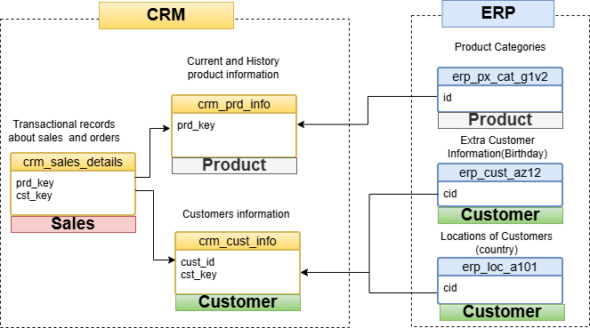
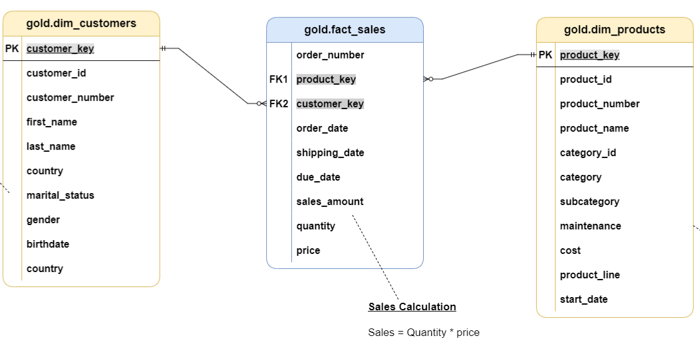
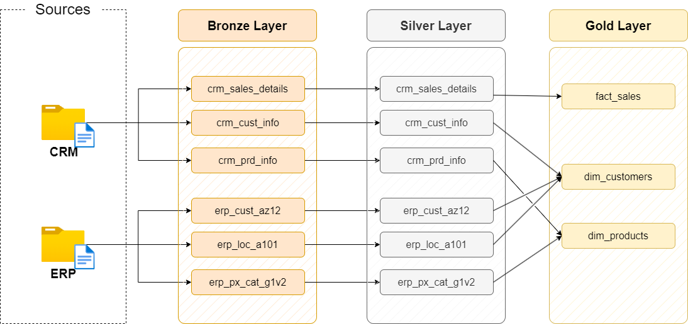

# 🚲 Bike Data Lakehouse: End-to-End Medallion Architecture

## 📌 Executive Summary

I built a data lakehouse on Databricks that transforms raw ERP and CRM data into clean, analytics-ready tables. The project uses the Medallion Architecture ( Bronze → Silver → Gold layers) with Delta Lake, PySpark, and Unity Catalog to handle data quality, governance, and historical tracking.

**Tech:** Databricks, Delta Lake, PySpark,SQL, Python, Unity Catalog, Databricks Workflows

---

## 🏗️ System Architecture
The pipeline follows a multi-layered approach to ensure data integrity and scalability:

* **🥉Bronze (Raw/Ingestion):** Direct ingestion of source CSVs into Delta tables (Schema-on-read, maintaining original state).
* **🥈 Silver (Curated/Cleaned):** Data deduplication, standardization of date formats, and business logic normalization (**PySpark/SQL**).
* **🥇Gold (Analytical/Aggregated):** Dimensional modeling (**Star Schema**) optimized for BI tools (PowerBI/Tableau) and advanced analytics.

.svg)

---

## 🛠️ Key Features
* **Data Governance:** Implemented **Unity Catalog** for fine-grained access control and metadata management.
* **Orchestration:** Automated end-to-end workflows using **Databricks Workflows (Jobs)** with modular task dependencies.
* **Data Quality:** Systematic cleaning including handling nulls, string normalization, and referential integrity checks.
* **Scalability:** Used a dictionary-driven ingestion pattern to reduce code redundancy (**DRY principle**).

---


## 🔍 Data Modeling & Intelligence (Gold Layer)
The final layer transitions from source-aligned data to a **Star Schema** (Dimensional Model). This design decouples the analytics layer from the source system logic, providing a high-performance environment for Business Intelligence and Data Science.

However, before building a new data model, we must first understand the original data model:
* What are the main business objects?
* How are these objects related to each other?
* 
By clearly analyzing the initial data model, we can identify three primary domains for the new dimensional model:
* Sales
* Product
* Customer

These domains will serve as the core labels (or subject areas) for designing the new star schema.



Based on this understanding of the source model and business domains, we designed the Gold Layer using a dimensional modeling approach. The resulting model consists of:

* **Fact Tables:** `fact_sales` (Grain: Individual Transaction). Captures business events and quantitative metrics.
* **Dimension Tables:** `dim_customers`, `dim_products`. Provides descriptive context for slicing and dicing metrics.





---


## Data Flow / Lineage

The diagram below shows the data lineage for our data Lakehouse. It helps to understand where the data comes from and makes it easier to troubleshoot issues.



--- 

## 📂 Project Structure
```bach
.
├── datasets/
├── code/
│   ├── init_lakehouse.ipynb
│   ├── bronze/
│   │   ├── bronze.ipynb
│   │   └── bronze_config.py
│   ├── silver/
│   │   ├── crm/
│   │   │   ├── silver_crm_cust_info.ipynb
│   │   │   ├── silver_crm_prd_info.ipynb
│   │   │   └── silver_crm_sales_details.ipynb
│   │   ├── erp/
│   │   │   ├── silver_erp_cust_az12.ipynb
│   │   │   ├── silver_erp_loc_a101.ipynb
│   │   │   └── silver_erp_px_cat_g1v2.ipynb
│   │   └── silver_orchestration.ipynb
│   └── gold/
│       ├── gold_dim_customers.ipynb
│       ├── gold_dim_products.ipynb
│       ├── gold_fact_sales.ipynb
│       └── gold_orchestration.ipynb
├── doc/
├── .gitignore
└── README.md


---
## 🛠️ Technologies & Tools

| Component | Technology |
|-----------|-----------|
| **Platform** | Databricks (AWS/Azure) |
| **Storage** | Delta Lake (ACID transactions) |
| **Processing** | Apache Spark (PySpark) |
| **Orchestration** | Databricks Jobs |
| **Catalog** | Unity Catalog |
| **Version Control** | Git (GitHub integration) |
| **Data Modeling** | Star Schema |


---


## 📈 Future Improvements
- [ ] **CI/CD Integration:** Automate deployment using **GitHub Actions** and **Databricks Asset Bundles (DABs)** for a true production-grade DevOps lifecycle.
- [ ] **New data sources** APIs, Kafka, streaming data, and operational databases
- [ ] - **Security and governance** : Access control, row-level security, and data masking


## 👨‍💻 Author
[Youssef Bouraha] Data Scientist | Data Engineer 
